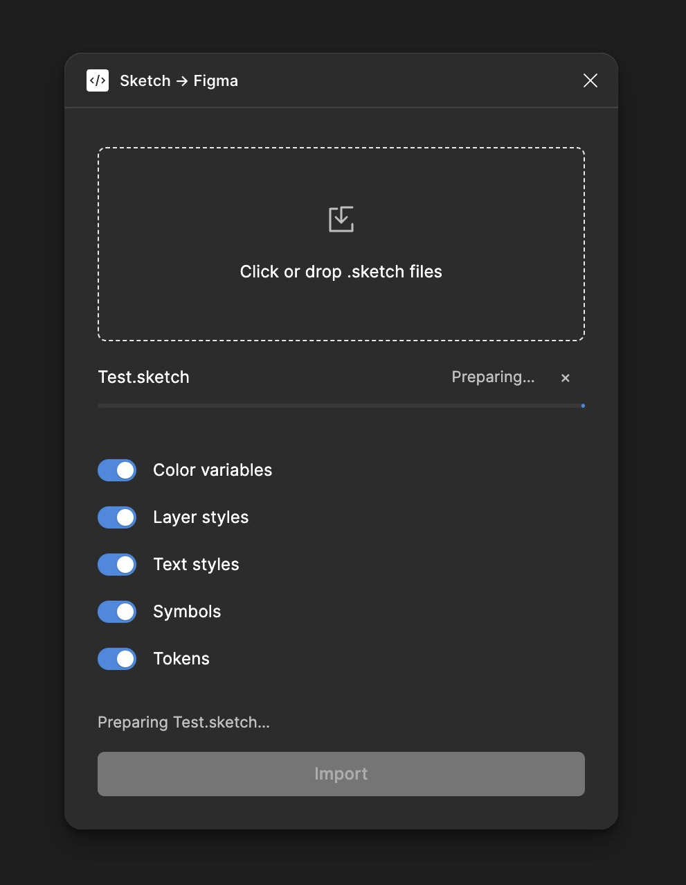
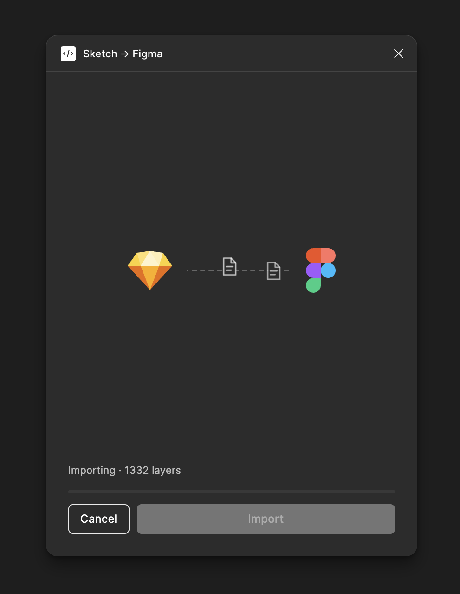
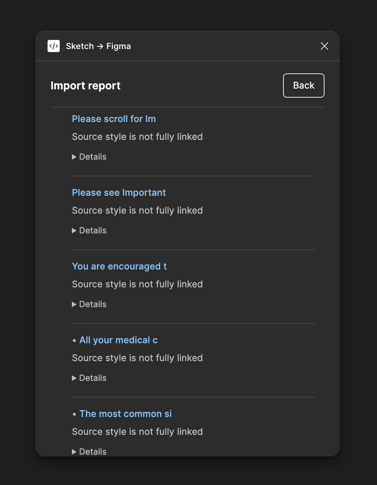

# Sketch to Figma Plugin

Import `.sketch` files into Figma as editable layers, components and design resources.

<p align="center">
  
  
  
</p>

## Features

| Area | Current support |
|---|---|
| Document structure | Pages, frames, groups, layer names and source identifiers |
| Color variables | Source swatches, original names and supported variable bindings |
| Layer styles | Editable fills and borders; compatible native Effect Styles |
| Text styles | Original local Text Styles, mixed formatting and binding reconciliation |
| Symbols | Native components, linked instances, nested relationships and supported overrides |
| Layout | Sketch Stacks mapped to Auto Layout, including supported padding, gaps, sizing, constraints and radii |
| Tokens | Explicitly supplied values, aliases, modes and compatible bindings |
| Shapes and images | Editable vector geometry, boolean operations, masks and embedded images |
| Reimport | Source identity reuse, local-edit handling and conversion audits |

## Installation

Requires Figma Desktop, Node.js and npm.

```sh
git clone https://github.com/Seyyahil/sketch-to-figma.git
cd sketch-to-figma
npm ci
npm run build
```

In Figma, open **Plugins → Development → Import plugin from manifest…**, select `manifest.json`, then run **Sketch → Figma**.

## Fidelity and limitations

The importer prioritizes editable Figma objects and retains source metadata for unsupported properties.

- Text overrides that Figma cannot retain alongside a named style preserve their appearance values, but may remain unbound. These ranges are reported.
- Advanced typography, responsive behavior, library dependencies and some appearance or prototype features remain incomplete.
- Oversized images use multiple image tiles to preserve source resolution.
- The visible report focuses on resources. Geometry checks remain in the complete stored audit.

## Documentation

- [Feature checklist](docs/FEATURE-CHECKLIST.md) — scope and implementation status
- [Compatibility matrix](docs/COMPATIBILITY.md) — supported mappings and API limitations
- [Architecture](docs/ARCHITECTURE.md) — importer structure and resource handling
- [Validation](docs/VALIDATION.md) — automated coverage and historical native evidence
